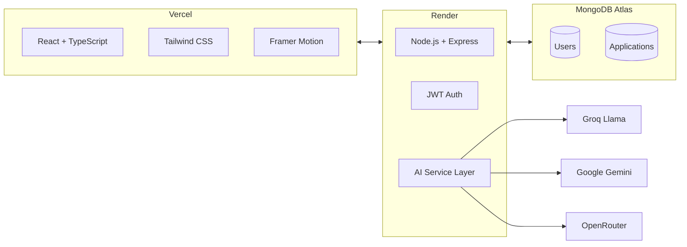

<div align="center">

  <picture>
    <source media="(prefers-color-scheme: dark)" srcset="https://raw.githubusercontent.com/harshi1111/job-tracker/main/frontend/public/logoalone.png">
    
  </picture>
  
  # PATHGRID
  ### Navigate Your Career Path
  
  [](https://job-tracker-six-gamma.vercel.app)
  [](https://job-tracker-ybmq.onrender.com)
  
</div>

<br>

> **An AI-powered job application tracker that doesn't just store your applications — it helps you win them.**

---

## ✦ The Grid

PATHGRID transforms chaotic job searching into a streamlined, intelligent workflow. Paste any job description, and our AI extracts the essentials while generating tailored resume bullets that actually get noticed.

<br>

| | | |
|:-:|:-:|:-:|
| **AI Parsing**<br><sub>Extracts company, role, skills, seniority, location</sub> | **Resume Coach**<br><sub>3-5 tailored bullets with one-click copy</sub> | **Kanban Pipeline**<br><sub>Drag & drop across 5 career stages</sub> |
| **Smart Reminders**<br><sub>Never miss a follow-up again</sub> | **Analytics Dashboard**<br><sub>Visualize your job search journey</sub> | **Export & Backup**<br><sub>CSV export for your records</sub> |

---

## ✦ The Architecture



## ✦ Quick Start

```bash
# Clone the grid
git clone https://github.com/harshi1111/job-tracker.git

# Enter the workspace
cd job-tracker

# Install backend dependencies
cd backend && npm install

# Install frontend dependencies
cd ../frontend && npm install

# Launch the grid (two terminals)
npm run dev  # Terminal 1: Backend
npm run dev  # Terminal 2: Frontend
```

<details>
<summary><b>✦ Environment Variables</b></summary>

**Backend (.env)**

```env
PORT=5001
MONGODB_URI=your_atlas_uri
JWT_SECRET=your_secret

GROQ_API_KEY_1=gsk_xxx
GROQ_API_KEY_2=gsk_xxx
GROQ_API_KEY_3=gsk_xxx

GEMINI_API_KEY_1=AIza_xxx
GEMINI_API_KEY_2=AIza_xxx

OPENROUTER_API_KEY_1=sk-or_xxx
OPENROUTER_API_KEY_2=sk-or_xxx
```

**Frontend (.env)**

```env
VITE_API_URL=http://localhost:5001/api
```
</details>

## ✦ Deployment

| Service | Platform | Purpose |
|---------|----------|---------|
| Frontend | Vercel | Static hosting, auto-deploys |
| Backend | Render | Node.js server, free tier |
| Database | MongoDB Atlas | Cloud database, 512MB free |

## ✦ Decisions & Trade-offs

| Decision | Why |
|----------|-----|
| **Multi-Key AI Rotation** | Free tier rate limits (100K tokens/day on Groq). Using 3 keys gives 300K tokens/day. |
| **Streaming AI Responses** | Better UX - users see AI working in real-time instead of waiting 5+ seconds. |
| **Groq as Primary AI** | Fastest inference speed (1000+ tokens/sec) compared to Gemini or OpenRouter. |
| **MongoDB Atlas** | Free 512MB cloud database, no local setup required for evaluators. |
| **Vercel + Render** | Best free combo: Vercel for static React, Render for persistent Node.js backend. |
| **Tailwind CSS** | Rapid UI development with built-in dark mode support. |
| **Framer Motion** | Smooth animations without heavy CSS keyframes. |
| **TypeScript** | Type safety across full stack, reduces runtime errors. |

## ✦ The Team Behind the Grid

<div align="center">
  <br>
  <sub>Built by <a href="https://github.com/harshi1111">Harshitha V</a></sub>
  <br>
  <sub>© 2026 PATHGRID — Navigate Your Career Path</sub>
</div>
```
