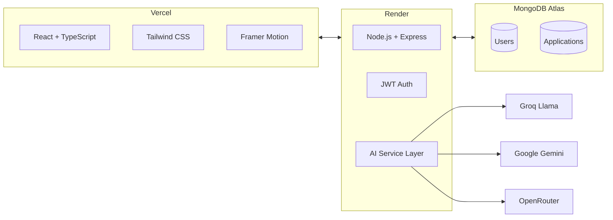

<div align="center">

  <picture>
    <source media="(prefers-color-scheme: dark)" srcset="https://raw.githubusercontent.com/harshi1111/job-tracker/main/frontend/public/logoalone.png">
    
  </picture>
  
  # PATHGRID
  ### Navigate Your Career Path
  
  [](https://job-tracker-six-gamma.vercel.app)
  [](https://youtu.be/R8QJgCV0_i0)
  
</div>
<br>

<div align="center">
  
  [About](#-the-grid) • 
  [Features](#-features-deep-dive) • 
  [Architecture](#-the-architecture) • 
  [Tech Stack](#-tech-stack) • 
  [Quick Start](#-quick-start) • 
  [Deployment](#-deployment) • 
  [API](#-api-endpoints) • 
  [Database](#-database-schema) • 
  [Decisions](#-decisions--trade-offs) • 
  
  
</div>

<br>
<br>

> **An AI-powered job application tracker that doesn't just store your applications — it helps you win them.**

---

## ✦ The Grid

PATHGRID transforms chaotic job searching into a **streamlined**, **intelligent workflow**. Paste any job description, and our **AI** extracts the essentials while generating **tailored resume bullets** that actually get noticed.

<br>

| | | |
|:-:|:-:|:-:|
| <br>**AI Parsing**<br><sub>Extracts company, role, skills, seniority, location</sub> | <br>**Resume Coach**<br><sub>3-5 tailored bullets with one-click copy</sub> | <br>**Kanban Pipeline**<br><sub>Drag & drop across 5 career stages</sub> |
| <br>**Smart Reminders**<br><sub>Never miss a follow-up again</sub> | <br>**Analytics Dashboard**<br><sub>Visualize your job search journey</sub> | <br>**Export & Backup**<br><sub>CSV export for your records</sub> |

## ✦ Features Deep Dive

<details>
<summary><b> AI Job Description Parser</b> — <i>Click to expand</i></summary>
<br>

- Extracts: **Company Name, Job Role, Required Skills, Nice-to-have Skills, Seniority Level, Location**
- **Streaming mode**: Watch AI extract information word-by-word (like ChatGPT)
- **Multi-key rotation**: Groq → Gemini → OpenRouter with automatic fallback
- **Loading states**: Visual feedback while AI processes
- **Error handling**: Graceful fallback if AI fails

</details>

<details>
<summary><b> AI Resume Suggestions</b> — <i>Click to expand</i></summary>
<br>

- Generates **3-5 tailored bullet points** specific to the job description
- Includes **metrics and results** (e.g., "Reduced latency by 85%")
- Uses **strong action verbs**: Built, Led, Optimized, Architected, Scaled
- **One-click copy** to clipboard for each suggestion
- Suggestions are **role-specific**, never generic

</details>

<details>
<summary><b> Kanban Board</b> — <i>Click to expand</i></summary>
<br>

- **5 stages**: Applied → Phone Screen → Interview → Offer → Rejected
- **Drag & drop** cards between columns with smooth animations
- **Celebration effect**: Confetti 🎉 when moving an application to "Offer"
- Each card shows: company, role, date applied, status
- **Overdue highlighting**: Red border for past-due follow-ups
- Click any card to **view, edit, or delete**

</details>

<details>
<summary><b> Smart Reminders</b> — <i>Click to expand</i></summary>
<br>

- Set **follow-up dates** for each application
- **Overdue highlighting**: Red border + "Overdue" badge
- **Reminder panel** shows:
  - Overdue follow-ups (with days overdue)
  - Upcoming follow-ups (next 7 days)
- Never miss a follow-up again

</details>

<details>
<summary><b> Analytics Dashboard</b> — <i>Click to expand</i></summary>
<br>

- **Stats cards** with rolling numbers
- **Application timeline chart** (filter by week/month/year)
- Real-time updates after each action

</details>

<details>
<summary><b>🔍 Search & Filter</b> — <i>Click to expand</i></summary>
<br>

- Search by **company name** or **job role**
- Filter by **date range**: Last 7 days / Last 30 days / Last year / Custom date
- **Active filter indicators** showing current filters
- One-click **clear all filters**

</details>

<details>
<summary><b> Export & Backup</b> — <i>Click to expand</i></summary>
<br>

- Export all applications to **CSV format**
- Includes all fields: company, role, status, date applied, notes, salary range, follow-up date, reminder notes

</details>

<details>
<summary><b>🎓 Guided Tour</b> — <i>Click to expand</i></summary>
<br>

- **Interactive walkthrough** for first-time users
- Highlights key features: Stats, Timeline, Reminders, Kanban, Search, Dark Mode
- **Auto-starts** for new users
- Manual trigger via **Help button (?)**
- Saves completion status in localStorage

</details>

<details>
<summary><b>✨ Animated Backgrounds</b> — <i>Click to expand</i></summary>
<br>

- **ShapeGrid**: Animated moving grid with hover effects on Landing/Login/Register pages
- **Iridescence**: Subtle iridescent effect in light mode
- **Hyperspeed**: Dynamic speed lines in dark mode
- **Responsive**: Adapts to all screen sizes

</details>

<details>
<summary><b>🌙 Dark Mode</b> — <i>Click to expand</i></summary>
<br>

- Toggle between **light and dark themes**
- **Persistent preference** saved in localStorage
- All components adapt seamlessly

</details>

<details>
<summary><b>🎉 Celebration Effect</b> — <i>Click to expand</i></summary>
<br>

- **Confetti animation** when moving an application to "Offer"
- Particle system with 120 falling confetti pieces
- Encourages users to celebrate their wins

</details>

## ✦ The Architecture


## ✦ Tech Stack


### Frontend

| Library | Version | Purpose |
|:--------|:--------|:--------|
| React | 19.2.4 | UI framework |
| TypeScript | 5.3.3 | Type safety |
| Tailwind CSS | 3.4.19 | Styling |
| Framer Motion | 12.38.0 | Animations |
| @hello-pangea/dnd | 18.0.1 | Drag & drop |
| Chart.js | 4.5.1 | Analytics |
| Lucide React | 1.7.0 | Icons |
| Axios | 1.14.0 | API calls |


### Backend

| Library | Version | Purpose |
|:--------|:--------|:--------|
| Node.js | 22.x | Runtime |
| Express | 4.18.2 | Web framework |
| TypeScript | 5.3.3 | Type safety |
| MongoDB | 9.4.1 | Driver |
| Mongoose | 9.4.1 | ODM |
| JWT | 9.0.3 | Auth |
| bcryptjs | 3.0.3 | Hashing |

### AI Providers

| Provider | Model | Purpose |
|:---------|:------|:--------|
| Groq | Llama 3.3 70B | Primary (fastest) |
| Gemini | flash-latest | Fallback |
| OpenRouter | GPT-OSS-20B | Secondary |

**Multi-Key Rotation:** 3 keys = 300K tokens/day

## ✦ Quick Start

```bash
# Clone the grid
git clone https://github.com/harshi1111/job-tracker.git

# Enter the workspace
cd job-tracker

# Install backend dependencies
cd backend && npm install

# Install frontend dependencies
cd ../frontend && npm install

# Launch the grid (two terminals)
npm run dev  # Terminal 1: Backend
npm run dev  # Terminal 2: Frontend
```

<details>
<summary><b>✦ Environment Variables</b></summary>

**Backend (.env)**

```env
PORT=5001
MONGODB_URI=your_atlas_uri
JWT_SECRET=your_secret

GROQ_API_KEY_1=gsk_xxx
GROQ_API_KEY_2=gsk_xxx
GROQ_API_KEY_3=gsk_xxx

GEMINI_API_KEY_1=AIza_xxx
GEMINI_API_KEY_2=AIza_xxx

OPENROUTER_API_KEY_1=sk-or_xxx
OPENROUTER_API_KEY_2=sk-or_xxx
```

**Frontend (.env)**

```env
VITE_API_URL=http://localhost:5001/api
```
</details>

## ✦ Deployment

| Service | Platform | Purpose |
|---------|----------|---------|
| Frontend | Vercel | Static hosting, auto-deploys |
| Backend | Render | Node.js server, free tier |
| Database | MongoDB Atlas | Cloud database, 512MB free |

## ✦ API Endpoints

| Method | Endpoint | Description |
|--------|----------|-------------|
| POST | `/api/auth/register` | Create new user |
| POST | `/api/auth/login` | Login user |
| GET | `/api/applications` | Get all applications |
| POST | `/api/applications` | Create application |
| PUT | `/api/applications/:id` | Update application |
| DELETE | `/api/applications/:id` | Delete application |
| POST | `/api/ai/parse-job` | Parse job description |
| POST | `/api/ai/resume-suggestions` | Generate suggestions |
| GET | `/api/stats` | Get global stats |

## ✦ Decisions & Trade-offs

| Decision | Why |
|----------|-----|
| **Multi-Key AI Rotation** | Free tier rate limits (100K tokens/day on Groq). Using 3 keys gives 300K tokens/day. |
| **Streaming AI Responses** | Better UX - users see AI working in real-time instead of waiting 5+ seconds. |
| **Groq as Primary AI** | Fastest inference speed (1000+ tokens/sec) compared to Gemini or OpenRouter. |
| **MongoDB Atlas** | Free 512MB cloud database, no local setup required for evaluators. |
| **Vercel + Render** | Best free combo: Vercel for static React, Render for persistent Node.js backend. |
| **Tailwind CSS** | Rapid UI development with built-in dark mode support. |
| **Framer Motion** | Smooth animations without heavy CSS keyframes. |
| **TypeScript** | Type safety across full stack, reduces runtime errors. |

## ✦ Database Schema

### User Model
```typescript
{
  email: string (unique)
  password: string (hashed)
  name: string
  createdAt: Date
}
```
### Application Model
```typescript
{
  userId: ObjectId;           
  company: string;
  role: string;
  jobDescriptionLink?: string;
  notes?: string;
  dateApplied: Date;
  status: 'applied' | 'phone-screen' | 'interview' | 'offer' | 'rejected';
  salaryRange?: string;
  skills: string[];
  resumeSuggestions: string[];
  jobDescription?: string;
  followUpDate?: Date;
  reminderNotes?: string;
  createdAt: Date;
  updatedAt: Date;
}
```

### Relationships

User → Applications: One-to-Many

Each application belongs to one user

Deleting a user cascades delete their applications

## ✦ The Team Behind the Grid

<div align="center">
  <br>
  <sub>Built by <a href="https://github.com/harshi1111">Harshitha V</a></sub>
  <br>
  <sub>© 2026 PATHGRID — Navigate Your Career Path</sub>
</div>
```
